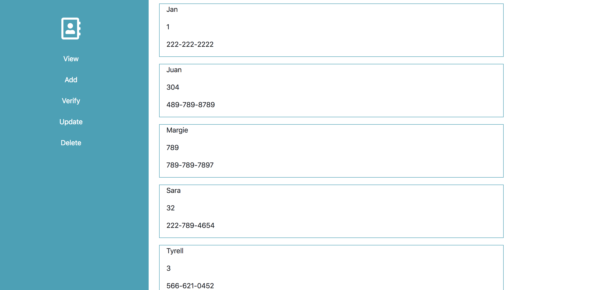
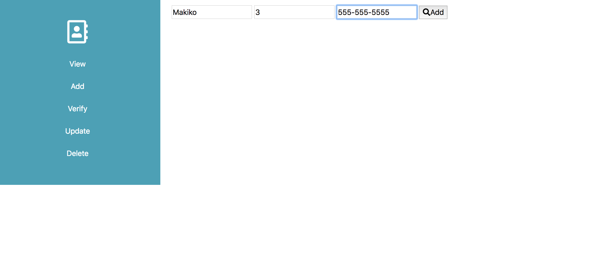
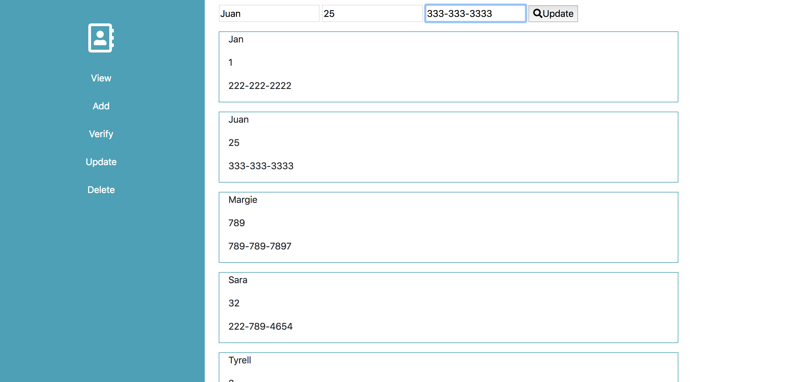
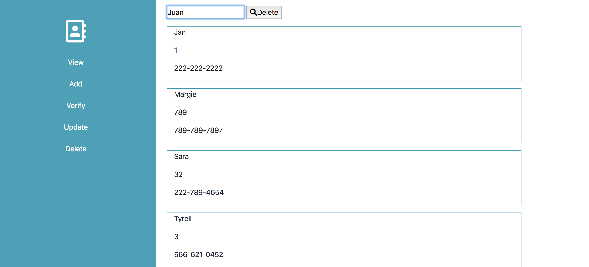

# Employee-Addressbook

## Description
This address book add, check, delete, and update the employee information.

## Structure of files

* index.html: Framework HTML
* employeeList.js: An array of objects that contain the list of employees.
* app.js:  Functions to display, add, check, and delete the employee list.
* dom.js: Library of DOM

***How to use***
___________________

1. Go to this URL to access this program ([Employee address book](https://makikovaughan.github.io/Employee-Addressbook/))

2. Click View to display the list of employees.

3. Click on Add to add the employee.

4. Click Verify to verify if the employee exists. If the employee exists, it displays "Yes". If not, "No".

5. Click on Update to update the information and then display the updated list.

5. Click on Delete the employee and then display the updated list.

### Note
You can access this site from:

https://makikovaughan.github.io/Bootstrap-Portfolio/portfolio.html

## Author
Makiko Vaughan